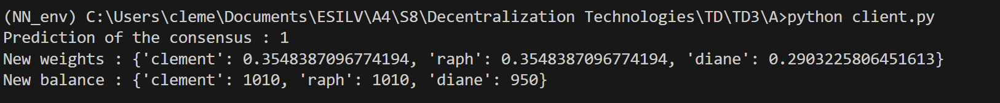
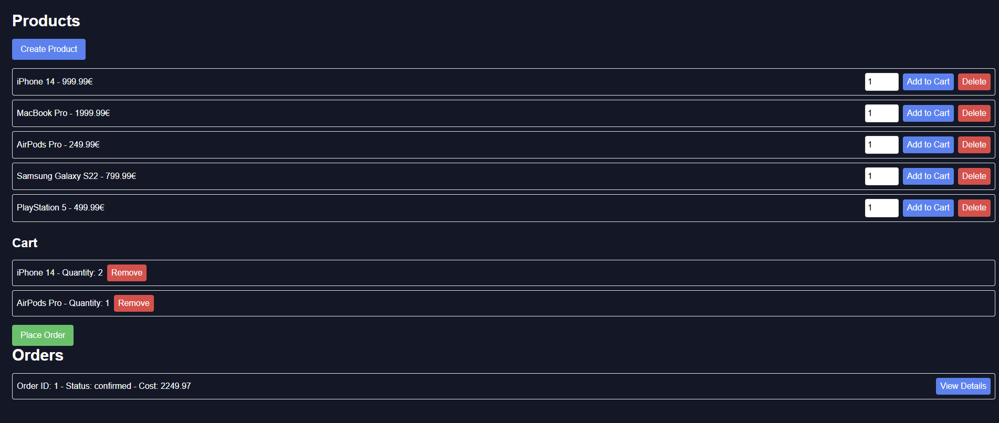

# TD3_Decentralization

## Part A

To run the prediction you need to launch the Flask server with this cmd in the A folder: `python3 app.py`

After that you need to map your port using ngrok with the cmd `ngrok http http://localhost:5000` and then copy the link that is generated and paste it in the client.py file in the A folder. You need to get the url of all the different model on the different machine.

Finally you can run the client with the cmd `python3 client.py` for the consensus. Moreover, I have added an example so that if all the servers are ready it will work just fine.

You will see there a proof that the connection between the different PCs using ngrok works and that the consensus is working.



## Part B

### Basic Implementation

To run the basic implementation, you need first of all to create a new Postgres database and user. After the creation of the database, you will run the file ini.sql to create the table and insert some example data. After that you will create at the root of the project a .env file with the following content:
```bash
DB_USER=user_name
DB_HOST=localhost
DB_NAME=database_name
DB_PASS=your_password
DB_PORT=5432
PORT=3001
```
Now you need to download the dependency with the cmd `npm install`. After that you can start the e commerce platform, first of all you need to launch the backend with all the api with the cmd `npx ts-node server/api.ts`. After that you need to launch the dns service with the cmd `npx ts-node server/dns.ts` that can switch the backend server url for the frontend so that if there is a backend pb our website will still be avalaible. Finally you can launch the frontend with the cmd `npm run dev`.

If you have follow these step correctly you will see the website with the different product and you can add them to your cart and buy them (place order) and see the content of the different order the user has done :


